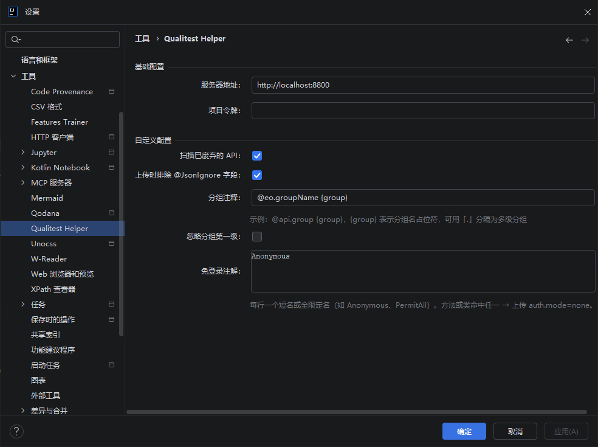
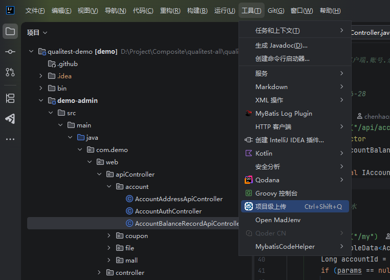
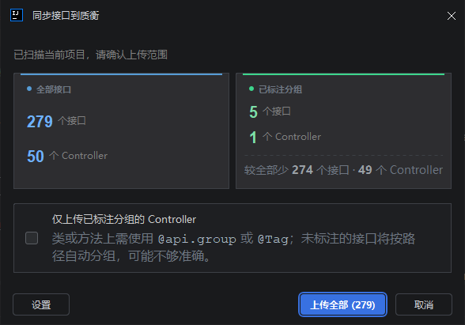
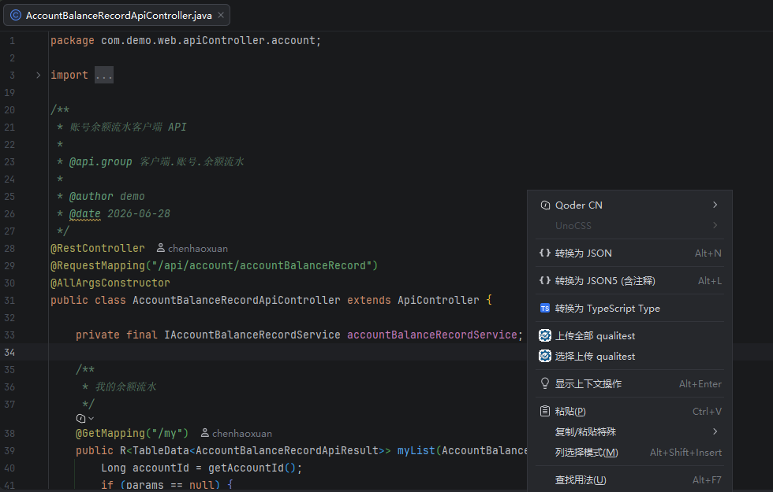
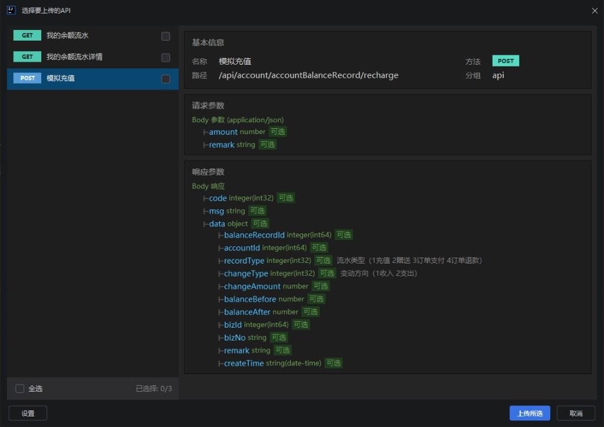

# Qualitest Helper（IntelliJ 插件）

面向 Java / Spring 项目的 **Qualitest** 平台配套插件：在 IDE 内扫描 Controller 接口元数据，并上传到 Qualitest 服务端。

## 相关仓库

| 仓库 | 说明 | GitHub | Gitee（只读镜像） |
|------|------|--------|-------------------|
| qualitest | 质衡主平台（服务端；含前端） | [GitHub](https://github.com/qualitest-hq/qualitest) | [Gitee](https://gitee.com/qualitest-hq/qualitest) |
| qualitest-demo | 推荐联调靶场 / 示例工程 | [GitHub](https://github.com/qualitest-hq/qualitest-demo) | [Gitee](https://gitee.com/qualitest-hq/qualitest-demo) |
| qualitest-intellij-plugin（本仓） | IDEA 插件 | [GitHub](https://github.com/qualitest-hq/qualitest-intellij-plugin) | [Gitee](https://gitee.com/qualitest-hq/qualitest-intellij-plugin) |

> GitHub 为主仓（Issue / PR / Release）；Gitee 为国内只读镜像，请勿向镜像提交代码。

| 项目事实 | 说明 |
|---------|------|
| **插件 ID** | `com.qualitest.qualitest-intellij-plugin` |
| **展示名称** | **Qualitest Helper**（设置页、Tools 菜单与编辑器右键菜单分组） |
| **当前版本** | `1.0.0`（见 `build.gradle.kts`） |
| **构建产物** | `./gradlew buildPlugin` 后在 `build/distributions/` 生成可分发的 ZIP |
| **GitHub Releases** | [Releases](https://github.com/qualitest-hq/qualitest-intellij-plugin/releases)（离线 ZIP） |
| **JetBrains Marketplace** | 已上架 · [市场页](https://plugins.jetbrains.com/plugin/34434-qualitest-helper)；IDE 内搜 **Qualitest Helper** |
| **目标 IDE** | `gradle.properties` 中 `platformVersion=2025.3.1`，`pluginSinceBuild=253`（对应 **2025.3** 一代构建号；请在 **2025.3+** 上安装使用） |

依赖的 IntelliJ 捆绑插件：`com.intellij.java`、`com.intellij.modules.json`、`org.intellij.plugins.markdown`（见 `plugin.xml`）。

---

## 功能概览

- **扫描 Spring MVC Controller**：识别 `@RestController`、`@Controller` 及常见映射注解，抽取路径、方法、参数、请求/响应结构等。
- **注解与文档**：支持 Spring MVC、Swagger/OpenAPI、Validation，以及 JavaDoc；并通过 **自定义 JavaDoc 标签注册**（`QualiTestCustomJavadocTagProvider`）减少分组类标签被标成「未知标签」的困扰。
- **上传入口**（见 `plugin.xml`）：
  - **Tools 菜单**：**项目级上传**（扫描整个工程，确认后批量上传；可勾选仅上传带 `@api.group` / `@Tag` 的 Controller）。
  - **编辑器右键**：当前 Controller 的「上传全部」或「选择上传」（选择上传支持分组过滤勾选）。
- **HTTP 对接**：使用请求头 `X-Project-Token` 调用服务端接口 `/api/project/importApis`（项目上下文由服务端根据 Token 解析，无需在请求体里传 `testProjectId`）。请求体带 `uploadType`：`project`（项目级）/ `controllerAll` / `controllerSelect`；仅 `project` 会在项目鉴权配置为空时写入通用单套 Bearer 种子（不分端、无匿名 path）。
- **上传前配置校验**：在确认上传（项目级确认框 / 选择上传对话框点「上传」）时，若服务器地址或项目令牌未配置，会提示并引导打开 **Settings → Tools → Qualitest Helper**。

---

## 配置说明

打开：**Settings（Preferences） → Tools → Qualitest Helper**。

| 配置项 | 含义 |
|--------|------|
| **服务器地址** | QualiTest 后端 Base URL，默认 `http://localhost:8800` |
| **项目令牌（Project Token）** | 用于上传鉴权，对应 HTTP 头 `X-Project-Token`（从 QualiTest 项目设置中获取）；**上传前必填** |
| **分组注释** | JavaDoc 中用于 API 分组的标签模式，默认与常量 `QualiTestConstants.DEFAULT_GROUP_TAG` 一致（如 `api.group {group}`） |
| **扫描已废弃的 API** | 是否包含标记为 deprecated 的接口 |
| **忽略分组第一级** | 为 true 时按首个 `.` 左侧去掉一层分组前缀（适用于带模块前缀的分组串） |

配置持久化在应用级存储 `qualitest-settings.xml`（由 `QualiTestSettings` 管理）。



---

## 使用方式

联调靶场推荐用 [qualitest-demo](https://github.com/qualitest-hq/qualitest-demo)（本截图即在该工程中操作）。

### 1. Tools 菜单（项目级上传）

1. 用 IntelliJ 打开 Java 工程（建议已配置好依赖以便 PSI 能解析类型）。
2. 菜单 **Tools → Qualitest Helper → 项目级上传**（快捷键 **Ctrl+Shift+Q**，Windows/Linux 默认键位）。



3. 插件在后台扫描整个项目中的 Controller API，随后弹出**确认上传**对话框：
   - 展示两行统计：**全量**与**分组注释**各自的 API / Controller 数量
   - 可勾选「仅上传带分组注释（@api.group / @Tag）的 Controller」后上传



4. 点击确认框中的「上传」时，若尚未配置服务器地址或项目令牌，会提示并引导前往设置页；网络异常时会给出可读的错误说明（而非 `null`）。

### 2. 编辑器右键（当前 Controller）

在 Controller 类对应的编辑器中右键：

| 菜单项 | 行为 |
|--------|------|
| **上传全部 qualitest** | 上传该文件中解析到的全部 API |
| **选择上传 qualitest** | 打开 `ApiSelectionDialog`，展示全量/分组注释统计，可勾选分组过滤后选择 API 上传 |



「选择上传」可勾选单条 API 并预览路径、参数与响应结构后再上传：



若当前文件不是 Controller 或无法解析，插件会给出相应错误提示（见资源包中的 `controller.error.*` 文案）。

上传前同样会校验服务器地址与项目令牌。

---

## 本地开发与调试

**环境建议**

- **JDK**：目标平台 **2025.3** 时建议使用 **JDK 21**（与 IDE 自带 JBR 一致；CI 亦用 21）。Gradle 8.x 下 JDK 17 通常仍可编译，但非 2025.x 首选。
- **IDE**：IntelliJ IDEA（推荐安装 **Plugin DevKit** 以便调试）。

**常用 Gradle 任务**（Windows PowerShell 使用 `.\gradlew`，类 Unix 使用 `./gradlew`）：

```powershell
# 编译、测试、打插件包（含 ZIP）
.\gradlew build

# 仅打可分发的插件 ZIP（输出在 build/distributions/）
.\gradlew buildPlugin

# 启动带本插件的沙箱 IDE（日常调试）
.\gradlew runIde

# 插件结构检查（轻量，日常可用）
.\gradlew verifyPluginStructure

# 二进制兼容性检查（默认只验当前 platformVersion，较快）
.\gradlew verifyPlugin

# 发版前全量 recommended IDE 矩阵（慢，可能 20～30+ 分钟）
.\gradlew verifyPlugin -PverifyRecommended=true

# 发布到 JetBrains Marketplace（需 Token，见下文）
.\gradlew publishPlugin
```

仓库内 **运行配置**：`.run/Run IDE with Plugin.run.xml` 已绑定 Gradle 任务 **`runIde`**，可在 IntelliJ 中直接运行/调试「Run IDE with Plugin」。

**清理沙箱**

`runIde`、`buildSearchableOptions` 等任务会在 **`build/idea-sandbox/`** 下生成临时 IDE 环境（配置、插件、日志等）。若遇到 locale 残留、`buildSearchableOptions` 报错、或沙箱内插件状态异常，可先清理再构建：

```powershell
# 推荐：删除整个 build 目录（含沙箱与构建产物）
.\gradlew clean

# 仅删除沙箱，保留其他 build 产物（Windows PowerShell）
Remove-Item -Recurse -Force .\build\idea-sandbox

# 清沙箱后重新验证（示例）
.\gradlew clean verifyPlugin
```

类 Unix 下仅删沙箱可用：`rm -rf build/idea-sandbox`。

说明：`buildSearchableOptions` 已关闭（避免每次打包启动沙箱 IDE）；设置页不会出现在 IDE「搜索设置」索引中。若上架前需要该索引，可在 `build.gradle.kts` 将 `buildSearchableOptions = true` 并视情况恢复 locale JVM 参数。

**版本与 Wrapper**

- `gradle.properties` 中 `platformVersion`、`pluginSinceBuild`、`gradleVersion` 与构建行为相关。
- `gradle/wrapper/gradle-wrapper.properties` 中的 **Gradle 发行版** 应与 `gradleVersion` 一致；对齐时可执行：`.\gradlew wrapper`。

---

## 打包与安装（离线 ZIP）

**推荐**：IDE 插件市场搜 **Qualitest Helper**，或打开 [Marketplace](https://plugins.jetbrains.com/plugin/34434-qualitest-helper)。亦可从 [GitHub Releases](https://github.com/qualitest-hq/qualitest-intellij-plugin/releases) 下 ZIP 离线安装。

本地自行打包：

1. 执行：`.\gradlew buildPlugin`
2. 在 **`build/distributions/`** 下找到生成的 **`.zip`**（名称通常包含插件名与版本）。
3. 在 IntelliJ 中：**Settings → Plugins → ⚙（齿轮）→ Install Plugin from Disk…**，选择该 ZIP，重启 IDE。

---

## 发版（维护者）

版本与变更说明**唯一来源**：[`build.gradle.kts`](build.gradle.kts) 中的 `version` 与 `changeNotes`（**不**维护根目录 `CHANGELOG.md`）。

### 版本规则

| 类型 | 何时升 | 示例 |
|------|--------|------|
| **PATCH** | bugfix、文案、小兼容 | `1.0.0` → `1.0.1` |
| **MINOR** | 新功能、`pluginSinceBuild` 上调 | `1.0.1` → `1.1.0` |
| **MAJOR** | 破坏性变更（协议删除等） | `1.x` → `2.0.0` |

- Git tag 格式：`v` + 与 `version` **完全一致**（如 `v1.0.1`）；workflow 会校验，不一致则失败。
- **同一版本不可再发**：已存在的 tag / Release 不能覆盖；修 BUG 必须升 PATCH。
- 首发 tag `v1.0.0` 已发布；后续正式版继续打 `v*` tag 触发 Release。
- 预发布：`v1.1.0-rc.1` 等会标为 GitHub Pre-release，且**不**发 Marketplace。

`changeNotes` 建议用 HTML 块、**顶部追加**最新版并保留历史（与 Marketplace 共用）：

```kotlin
changeNotes = """
    <b>1.0.1</b>
    <ul>
      <li>Fix: …</li>
    </ul>
    <br/>
    <b>1.0.0</b>
    <ul>
      <li>Initial release</li>
    </ul>
""".trimIndent()
```

### 发版步骤

1. 在 `main` 上更新 `version` + `changeNotes`。
2. 本地可选：`.\gradlew verifyPlugin -PverifyRecommended=true buildPlugin`（JDK **21**）。
3. 合并 PR，确认 [**CI**](https://github.com/qualitest-hq/qualitest-intellij-plugin/actions/workflows/ci.yml) 通过（JDK 21；`test` + `verifyPluginStructure` + `verifyPlugin`）。
4. 打 tag 并推送：

   ```bash
   git tag v1.0.1
   git push origin v1.0.1
   ```

5. [**Release workflow**](https://github.com/qualitest-hq/qualitest-intellij-plugin/actions/workflows/release.yml) 自动：全量 `verifyPlugin` → `buildPlugin` → 创建 GitHub Release 并附 ZIP。

**阶段 B（Marketplace）**：`1.0.0` 已上架。后续版本：在 Org 配置 `PUBLISH_TOKEN`，并将 [`.github/workflows/release.yml`](.github/workflows/release.yml) 中 `marketplace` job 的 `if: false` 改为启用条件，由 CI 自动 `publishPlugin`。

---

## 发布到 JetBrains Marketplace

**状态**：`1.0.0` 已上架 → [Marketplace](https://plugins.jetbrains.com/plugin/34434-qualitest-helper)。

后续版本发布：

1. 在 [JetBrains Marketplace](https://plugins.jetbrains.com/) 插件条目取得 **永久令牌（Publish Token）**。
2. 将令牌置于环境变量（常见名为 **`PUBLISH_TOKEN`**），并在 `build.gradle.kts` 中启用 `intellijPlatform { publishing { ... } }`（`publishing.token` 已预留；Release workflow 的 `marketplace` job 默认关闭，见上文「发版 · 阶段 B」）。
3. 执行：`.\gradlew publishPlugin`（必要时配合 Marketplace 对插件 **ZIP 签名** 的要求使用 `signPlugin` 等任务，以官方文档为准）。

发布前务必：**提升版本号**（`build.gradle.kts` 的 `version`）、更新 **`changeNotes`**、运行 **`.\gradlew verifyPlugin -PverifyRecommended=true`**（全量矩阵）。

---

## 代码结构（摘要）

核心包：`src/main/java/com/qualitest/`。

- **`action/`**：`ScanApiAction`（项目级上传）、`ControllerUploadAllAction`、`ControllerSelectUploadAction` 及共用逻辑 `ControllerUploadSupport`
- **`config/`**：`QualiTestSettings`、`QualiTestConfigurable`、`QualiTestSettingsPanel`、`UploadConfigSupport`
- **`http/`**：`ApiClient`（上传）
- **`scan/`**：`ApiScanner`、`ApiScannerSupport`、`ExplicitGroupChecker`、`ApiUploadFilters`、`UploadScanStats`、`visitor.ControllerVisitor`、`extractor.*`、`resolver.*`、`model.*`
- **`ui/`**：`UploadConfirmDialog`、`UploadStatsPanel`、`UploadTaskSupport`、`ApiSelectionDialog`、`ApiSelectionPanel`（Controller 选择上传对话框）、`ApiSelectionDetailBuilder`、`render.*`
- **`javadoc/`**：`QualiTestCustomJavadocTagProvider`
- **`UploadErrors`**：统一格式化上传失败通知文案

国际化：`src/main/resources/messages/QualiTestBundle.properties`（及 `_zh_CN`）。

插件声明：`src/main/resources/META-INF/plugin.xml`。

---

## 技术栈

| 组件 | 说明 |
|------|------|
| IntelliJ Platform SDK | UI、PSI、Settings、Action |
| IntelliJ Platform Gradle Plugin | 见 `gradle/libs.versions.toml` 中的 `org.jetbrains.intellij.platform` |
| Gson | JSON |
| Lombok | 样板代码缩减 |
| `java.net.http.HttpClient` | HTTP 客户端 |

---

## License

Apache License 2.0. See [LICENSE](LICENSE) and [NOTICE](NOTICE).

## 社区

- [贡献指南](./CONTRIBUTING.md) · [行为准则](./CODE_OF_CONDUCT.md) · [安全策略](./SECURITY.md)

## 联系方式

- Website: https://qualitest-hq.github.io/qualitest/  
- GitHub（主仓）: https://github.com/qualitest-hq/qualitest-intellij-plugin  
- Gitee（只读镜像）: https://gitee.com/qualitest-hq/qualitest-intellij-plugin  
- 安全披露：见 [SECURITY.md](./SECURITY.md)（邮件 `38680050@qq.com`）

